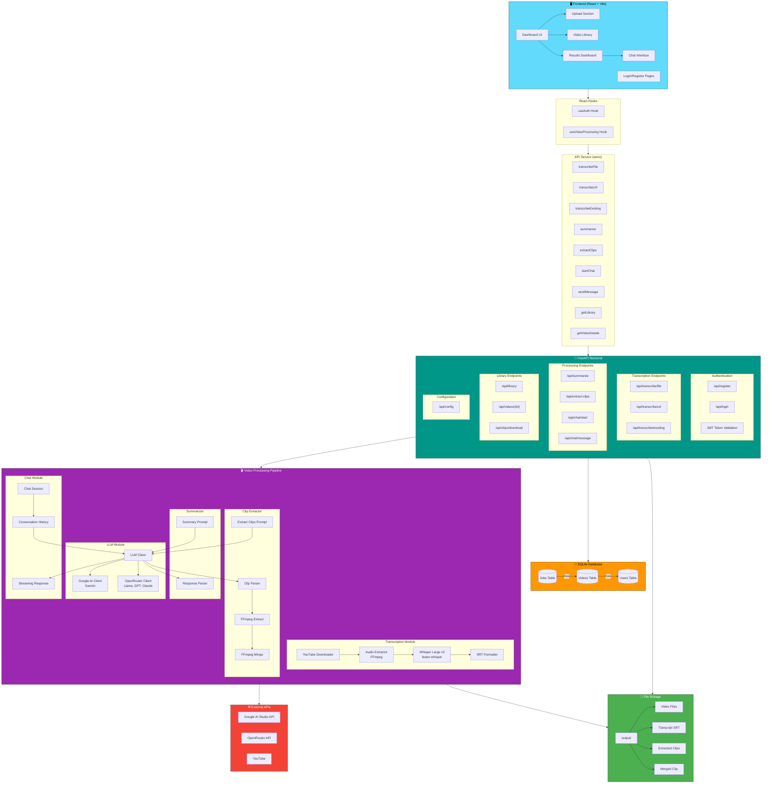
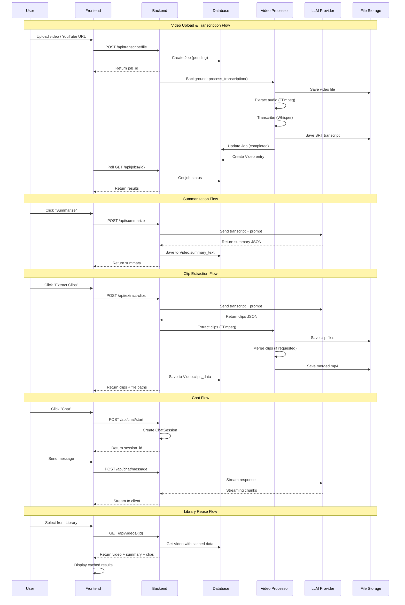
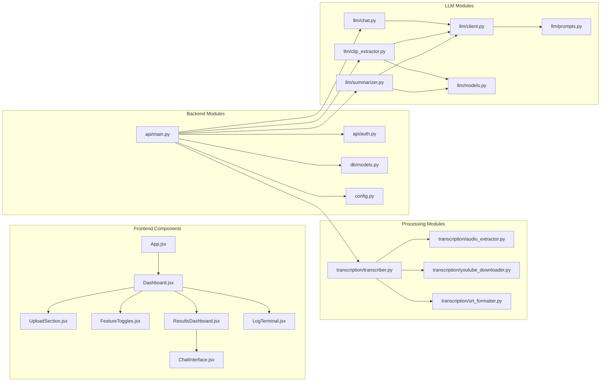

# Video Summarizer Architecture

## Mermaid Flowchart

```mermaid
flowchart TB
    subgraph Frontend["🖥️ Frontend (React + Vite)"]
        UI[Dashboard UI]
        Auth[Login/Register Pages]
        Upload[Upload Section]
        Library[Video Library]
        Results[Results Dashboard]
        Chat[Chat Interface]
        
        UI --> Upload
        UI --> Library
        UI --> Results
        Results --> Chat
    end

    subgraph Hooks["React Hooks"]
        useAuth[useAuth Hook]
        useVideoProcessing[useVideoProcessing Hook]
    end

    subgraph APIService["API Service (axios)"]
        transcribeFile[transcribeFile]
        transcribeUrl[transcribeUrl]
        transcribeExisting[transcribeExisting]
        summarize[summarize]
        extractClips[extractClips]
        startChat[startChat]
        sendMessage[sendMessage]
        getLibrary[getLibrary]
        getVideoDetails[getVideoDetails]
    end

    Frontend --> Hooks
    Hooks --> APIService

    subgraph Backend["🐍 FastAPI Backend"]
        direction TB
        
        subgraph AuthModule["Authentication"]
            Register["/api/register"]
            Login["/api/login"]
            JWT[JWT Token Validation]
        end

        subgraph TranscriptionAPI["Transcription Endpoints"]
            TransFile["/api/transcribe/file"]
            TransURL["/api/transcribe/url"]
            TransExisting["/api/transcribe/existing"]
        end

        subgraph ProcessingAPI["Processing Endpoints"]
            SummarizeAPI["/api/summarize"]
            ClipsAPI["/api/extract-clips"]
            ChatStartAPI["/api/chat/start"]
            ChatMsgAPI["/api/chat/message"]
        end

        subgraph LibraryAPI["Library Endpoints"]
            LibraryGet["/api/library"]
            VideoDetails["/api/videos/{id}"]
            ClipDownload["/api/clips/download"]
        end

        subgraph ConfigAPI["Configuration"]
            Config["/api/config"]
        end
    end

    APIService --> Backend

    subgraph Database["💾 SQLite Database"]
        Users[(Users Table)]
        Videos[(Videos Table)]
        Jobs[(Jobs Table)]
        
        Videos --> |has| Users
        Jobs --> |has| Videos
    end

    Backend --> Database

    subgraph VideoProcessor["🎬 Video Processing Pipeline"]
        direction TB
        
        subgraph Transcription["Transcription Module"]
            YouTubeDL[YouTube Downloader]
            AudioExtract[Audio Extractor<br/>FFmpeg]
            Whisper[Whisper Large v3<br/>faster-whisper]
            SRTFormat[SRT Formatter]
            
            YouTubeDL --> AudioExtract
            AudioExtract --> Whisper
            Whisper --> SRTFormat
        end

        subgraph LLMModule["LLM Module"]
            LLMClient[LLM Client]
            GoogleAI[Google AI Client<br/>Gemini]
            OpenRouter[OpenRouter Client<br/>Llama, GPT, Claude]
            
            LLMClient --> GoogleAI
            LLMClient --> OpenRouter
        end

        subgraph Summarizer["Summarizer"]
            SumPrompt[Summary Prompt]
            SumParser[Response Parser]
            SumPrompt --> LLMClient
            LLMClient --> SumParser
        end

        subgraph ClipExtractor["Clip Extractor"]
            ClipPrompt[Extract Clips Prompt]
            ClipParser[Clip Parser]
            FFmpegExtract[FFmpeg Extract]
            FFmpegMerge[FFmpeg Merge]
            
            ClipPrompt --> LLMClient
            LLMClient --> ClipParser
            ClipParser --> FFmpegExtract
            FFmpegExtract --> FFmpegMerge
        end

        subgraph ChatModule["Chat Module"]
            ChatSession[Chat Session]
            ChatHistory[Conversation History]
            StreamResponse[Streaming Response]
            
            ChatSession --> ChatHistory
            ChatHistory --> LLMClient
            LLMClient --> StreamResponse
        end
    end

    Backend --> VideoProcessor

    subgraph ExternalAPIs["🌐 External APIs"]
        GoogleAPI[Google AI Studio API]
        OpenRouterAPI[OpenRouter API]
        YouTube[YouTube]
    end

    VideoProcessor --> ExternalAPIs

    subgraph Storage["📁 File Storage"]
        OutputDir[output/]
        VideoFiles[Video Files]
        TranscriptFiles[Transcript SRT]
        ClipFiles[Extracted Clips]
        MergedClip[Merged Clip]
        
        OutputDir --> VideoFiles
        OutputDir --> TranscriptFiles
        OutputDir --> ClipFiles
        OutputDir --> MergedClip
    end

    VideoProcessor --> Storage
    Backend --> Storage

    %% Styling
    classDef frontend fill:#61dafb,stroke:#333,color:#000
    classDef backend fill:#009688,stroke:#333,color:#fff
    classDef database fill:#ff9800,stroke:#333,color:#000
    classDef processor fill:#9c27b0,stroke:#333,color:#fff
    classDef external fill:#f44336,stroke:#333,color:#fff
    classDef storage fill:#4caf50,stroke:#333,color:#fff

    class Frontend frontend
    class Backend backend
    class Database database
    class VideoProcessor processor
    class ExternalAPIs external
    class Storage storage
```

## Data Flow

```mermaid
sequenceDiagram
    participant U as User
    participant FE as Frontend
    participant BE as Backend
    participant DB as Database
    participant VP as Video Processor
    participant LLM as LLM Provider
    participant FS as File Storage

    Note over U,FS: Video Upload & Transcription Flow
    U->>FE: Upload video / YouTube URL
    FE->>BE: POST /api/transcribe/file
    BE->>DB: Create Job (pending)
    BE-->>FE: Return job_id
    
    BE->>VP: Background: process_transcription()
    VP->>FS: Save video file
    VP->>VP: Extract audio (FFmpeg)
    VP->>VP: Transcribe (Whisper)
    VP->>FS: Save SRT transcript
    VP->>DB: Update Job (completed)
    VP->>DB: Create Video entry
    
    FE->>BE: Poll GET /api/jobs/{id}
    BE->>DB: Get job status
    BE-->>FE: Return results

    Note over U,FS: Summarization Flow
    U->>FE: Click "Summarize"
    FE->>BE: POST /api/summarize
    BE->>LLM: Send transcript + prompt
    LLM-->>BE: Return summary JSON
    BE->>DB: Save to Video.summary_text
    BE-->>FE: Return summary

    Note over U,FS: Clip Extraction Flow
    U->>FE: Click "Extract Clips"
    FE->>BE: POST /api/extract-clips
    BE->>LLM: Send transcript + prompt
    LLM-->>BE: Return clips JSON
    BE->>VP: Extract clips (FFmpeg)
    VP->>FS: Save clip files
    VP->>VP: Merge clips (if requested)
    VP->>FS: Save merged.mp4
    BE->>DB: Save to Video.clips_data
    BE-->>FE: Return clips + file paths

    Note over U,FS: Chat Flow
    U->>FE: Click "Chat"
    FE->>BE: POST /api/chat/start
    BE->>BE: Create ChatSession
    BE-->>FE: Return session_id
    
    U->>FE: Send message
    FE->>BE: POST /api/chat/message
    BE->>LLM: Stream response
    LLM-->>BE: Streaming chunks
    BE-->>FE: Stream to client

    Note over U,FS: Library Reuse Flow
    U->>FE: Select from Library
    FE->>BE: GET /api/videos/{id}
    BE->>DB: Get Video with cached data
    BE-->>FE: Return video + summary + clips
    FE->>FE: Display cached results
```

## Component Diagram

```mermaid
graph LR
    subgraph "Frontend Components"
        App[App.jsx]
        Dashboard[Dashboard.jsx]
        UploadSection[UploadSection.jsx]
        FeatureToggles[FeatureToggles.jsx]
        ResultsDashboard[ResultsDashboard.jsx]
        ChatInterface[ChatInterface.jsx]
        LogTerminal[LogTerminal.jsx]
    end

    subgraph "Backend Modules"
        API[api/main.py]
        AuthMod[api/auth.py]
        DBModels[db/models.py]
        Config[config.py]
    end

    subgraph "Processing Modules"
        Transcriber[transcription/transcriber.py]
        AudioExtractor[transcription/audio_extractor.py]
        YouTubeDownloader[transcription/youtube_downloader.py]
        SRTFormatter[transcription/srt_formatter.py]
    end

    subgraph "LLM Modules"
        LLMClient[llm/client.py]
        Summarizer[llm/summarizer.py]
        ClipExtractor[llm/clip_extractor.py]
        ChatMod[llm/chat.py]
        Prompts[llm/prompts.py]
        Models[llm/models.py]
    end

    App --> Dashboard
    Dashboard --> UploadSection
    Dashboard --> FeatureToggles
    Dashboard --> ResultsDashboard
    Dashboard --> LogTerminal
    ResultsDashboard --> ChatInterface

    API --> AuthMod
    API --> DBModels
    API --> Config
    API --> Transcriber
    API --> Summarizer
    API --> ClipExtractor
    API --> ChatMod

    Transcriber --> AudioExtractor
    Transcriber --> YouTubeDownloader
    Transcriber --> SRTFormatter

    Summarizer --> LLMClient
    ClipExtractor --> LLMClient
    ChatMod --> LLMClient
    LLMClient --> Prompts
    Summarizer --> Models
    ClipExtractor --> Models
```
