# Video Summarizer Architecture

This document provides a comprehensive overview of the Video Summarizer system architecture through professional diagrams.

## 📐 System Architecture Overview

This diagram illustrates the complete system architecture, showing the interaction between frontend, backend, processing pipeline, and external services.

```mermaid
flowchart TB
    subgraph Client["👤 Client Layer"]
        User[User/Browser]
    end

    subgraph Frontend["🖥️ Frontend Application<br/>(React + Vite)"]
        UI[Dashboard UI]
        Auth[Authentication]
        Upload[Video Upload]
        Library[Video Library]
        Results[Results Display]
        Chat[Chat Interface]
    end

    subgraph Backend["🐍 Backend Services<br/>(FastAPI)"]
        direction TB
        
        subgraph API["API Layer"]
            AuthAPI[Auth Endpoints<br/>/api/register, /api/login]
            TransAPI[Transcription Endpoints<br/>/api/transcribe/*]
            ProcAPI[Processing Endpoints<br/>/api/summarize, /api/extract-clips]
            ChatAPI[Chat Endpoints<br/>/api/chat/*]
            LibAPI[Library Endpoints<br/>/api/library, /api/videos/*]
        end

        subgraph Core["Core Processing"]
            direction LR
            Trans[Transcription<br/>Module]
            LLM[LLM<br/>Module]
            ChatMod[Chat<br/>Module]
        end
    end

    subgraph Processing["🎬 Video Processing Pipeline"]
        direction TB
        YT[YouTube<br/>Downloader]
        Audio[Audio Extractor<br/>FFmpeg]
        Whisper[Speech-to-Text<br/>Whisper Large v3]
        Summary[AI Summarization<br/>Gemini/GPT/Claude]
        Clips[Clip Extraction<br/>+ Merging]
    end

    subgraph Data["💾 Data Layer"]
        DB[(SQLite DB<br/>Users, Videos, Jobs)]
        Files[File Storage<br/>Videos, Transcripts, Clips]
    end

    subgraph External["🌐 External Services"]
        GoogleAI[Google AI<br/>Gemini]
        OpenRouter[OpenRouter<br/>GPT/Claude/Llama]
        YouTube[YouTube]
    end

    User --> Frontend
    Frontend <--> API
    API --> Core
    Core --> Processing
    Processing --> Data
    Core <--> External
    Processing --> External
    
    Trans --> YT
    Trans --> Audio
    Trans --> Whisper
    LLM --> Summary
    LLM --> Clips
    
    YT -.-> YouTube
    Summary -.-> GoogleAI
    Summary -.-> OpenRouter
    Clips -.-> GoogleAI
    Clips -.-> OpenRouter
    ChatMod -.-> GoogleAI
    ChatMod -.-> OpenRouter

    style Client fill:#e3f2fd,stroke:#1976d2,stroke-width:2px
    style Frontend fill:#bbdefb,stroke:#1976d2,stroke-width:2px
    style Backend fill:#c8e6c9,stroke:#388e3c,stroke-width:2px
    style Processing fill:#fff9c4,stroke:#f57c00,stroke-width:2px
    style Data fill:#ffccbc,stroke:#d84315,stroke-width:2px
    style External fill:#f8bbd0,stroke:#c2185b,stroke-width:2px
```

### Key Features

| Component | Capabilities |
|-----------|-------------|
| 🎤 **Transcription** | Speech-to-text conversion using Whisper AI (Arabic & English support) |
| 📝 **Summarization** | AI-powered video summaries with key points extraction |
| ✂️ **Clip Extraction** | Automated identification and extraction of important video segments |
| 🔗 **Clip Merging** | Combine multiple clips into a single highlight video |
| 💬 **Interactive Chat** | Q&A interface with video context awareness and streaming responses |
| 📚 **Video Library** | Persistent storage with caching for processed videos and results |
| 🔐 **Authentication** | Secure JWT-based user authentication and session management |
| 🌐 **YouTube Support** | Direct processing of YouTube URLs with auto-download |

---

## 🔄 Data Flow & Processing Pipeline

This sequence diagram shows the end-to-end data flow for the complete video processing lifecycle.

---

## 🧩 Technology Stack

| Layer | Technologies |
|-------|-------------|
| **Frontend** | React, Vite, Axios, Modern UI with Glassmorphism |
| **Backend** | FastAPI, Python 3.9+, JWT Authentication |
| **Database** | SQLite (SQLAlchemy ORM) |
| **AI/ML** | Whisper Large v3 (faster-whisper), Google Gemini, OpenRouter (GPT/Claude/Llama) |
| **Video Processing** | FFmpeg (audio extraction, clip cutting, video merging) |
| **External APIs** | YouTube, Google AI Studio, OpenRouter |
| **File Storage** | Local filesystem (output/ directory) |
